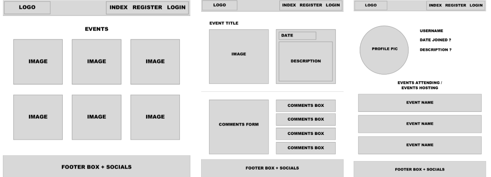

#   WDI Project Three: GigHub

## Brief
With your team, build a MEAN stack app of your own design. Your app must:

* Use Mongo, Node & Express to build a server-side API
* Your API must have at least 2 related models, one of which should be a user
* Your API should include all RESTFUL actions for at least one of those models
* Include authentication to restrict access to appropriate users
* Include at least one referenced or embedded sub-document
* Include automated tests for at least one resource
* Use Angular to build a front-end that consumes your API
* Use SCSS instead of CSS
* Use Webpack & Yarn to manage your dependencies and compile your source code

**Timeframe**: 1 week

## Overview
View on Heroku [here.](https://gighub-projectthree.herokuapp.com/#!/)

My third project at General Assembly was a collaborative three-person effort to build a fully RESTful gig listing app, allowing venues to upload upcoming events to an open platform which users can then search for and click to attend. We used MongoDB, Node.js & Express to build the server-side API, and AngularJS to build the front-end that consumes our API.


## Planning
### Trello
Organising our workloads with Trello was extremely beneficial for a team of this size and project of relative complexity. The 'In Progress' column was particularly useful during times when we were not physically working in the same place as a way of seeing who was working on which file. 


### Wireframes
Drawing up these wireframes before we started coding was a useful way of making sure we were all working to the same vision, and would later avoid conflict as the design basics had already been set in place. 



## Technologies Used

* Angular
* JavaScript (ES6)
* HTML5
* SCSS
* Bulma CSS Framework
* Git
* GitHub
* Insomnia
* bcrypt
* JWT
* Mongoose
* Heroku
* Trello
* Yarn
* Chai
* Mocha
* Leaflet.js map
* OpenStreetMap API

## Wins and Challenges

### Wins
I am really pleased with how much I enjoyed working as a team during this project. From the outset, we used Trello to plan and monitor our progress and stay on top of who worked on what. I found the encouraging dynamic of our team motivated me to work with more energy and timeliness than previous projects.

In terms of individual work, I am most pleased with how I managed to implement the 'click to attend' button on the event show pages. On the back-end, I created an attendee controller with a create route to push the user's ID to the event's attendees array

#### Event Model:
<pre>
const eventSchema = mongoose.Schema({
  title: String,
  artist: String,
  ...
  <b>attendees: [
    { type: mongoose.Schema.ObjectId, ref: 'User' }
  ]</b>
});
</pre>

#### Attendee Controller
<pre>
  function indexRoute(req, res, next) {
    Event
      .findById(req.params.eventId)
      .populate('attendees')
      .then(event => res.json(event.attendees))
      .catch(next);
  }

  function createRoute(req, res, next) {
    getTokenFromHttpRequest(req);
    Event
      .findById(req.params.eventId)
      <b>.then(event => {
        event.attendees.push(userId);
        return event.save();
      })</b>
      .then(event => res.json(event))
      .catch(next);
  }
</pre>


On the front-end, I added alreadyAttending to scope, if the event's attendeees already contained the current user's ID:

<pre>
function showCtrl($state, $scope, $http, $auth) {
  $scope.comment = {};
  $http({
    method: 'GET',
    url: `/api/events/${$state.params.id}`
  }).then(result => {
    $scope.event = result.data;
    <b>$scope.alreadyAttending = result.data.attendees.includes($auth.getPayload().sub);</b>
    console.log('$scope.event', $scope.event);
  });
</pre>


I then displayed the number of attendees and the button 'Click to attend' or 'Attending' depending on alreadyAttending:

```
  <p class="attendance-button">Members attending: <strong>{{ event.attendees.length }}</strong></p>
  <div class="buttons" ng-if="isAuthenticated() && !isVenue()">
    <a class="button attendance-button" ng-if="!alreadyAttending" ng-click="handleClickAttending()">Click to attend</a>
    <a class="button attendance-button" ng-if="alreadyAttending">Attending</a>
  </div>
```
 
 
I would like to add a button to allow users to un-attend events, but did not manage to get around to this during the project. 


### Challenges
Coming to a decision on styling was the only real challenge of working in this group. As three individuals with strong ideas of how the app should look, it was particularly important to to allow everyone to input their vision and then come to a compromise. We found that following UX and design practices exemplified by other comparable websites to be helpful in resolving conflicts of opinion.

## Future Work
* Create a user verification system, whereby the app administrators can accept or decline venue registration requests
* Allow users to follow venues and then show followed venues' events on the 'All Events' page
* Suggest events to users based on which events they attend
* Allow users to click 'No longer attending'
* Mobile responsiveness
